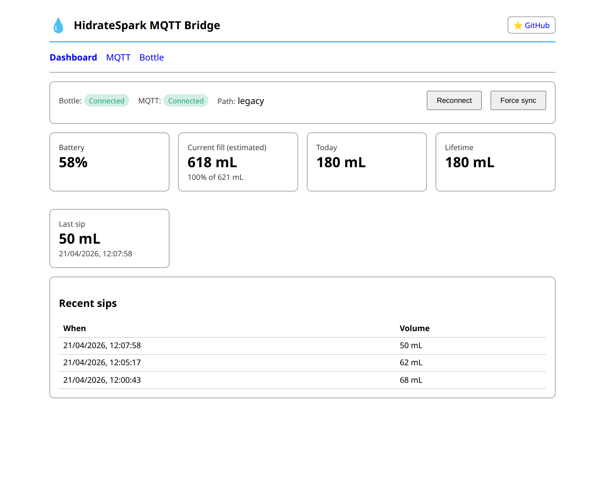

# HidrateSpark MQTT Bridge

A self-hosted Docker bridge that connects to a HidrateSpark smart water bottle over BLE and publishes live drinking data — sips, totals, current fill level, battery, refill events — to MQTT, with full Home Assistant auto-discovery.

Huh???

Yes, it synchronises my water bottle to my home automation system.


## Why this exists

The HidrateSpark mobile app is fine, but if you live in Home Assistant you want the bottle's data on the wall, in dashboards, and driving automations. This bridge runs on a Linux box near your bottle (a Pi, an Intel NUC, anything with Bluetooth) and turns the bottle into a normal MQTT device — no cloud, no phone required, no Garmin watch.

It is a from-scratch reimplementation that:

- **Performs the proper BLE handshake** (13-step sequence borrowed from [maxperron/HydroSync](https://github.com/maxperron/HydroSync)) so the bottle actually streams data instead of going silent.
- **Keeps a single persistent BLE connection** with auto-reconnect & exponential back-off (the previous container reopened a connection per request — that's why nothing worked).
- **Publishes Home Assistant MQTT discovery** — the device shows up automatically with battery, totals, current fill, last sip time, and weight diagnostics.
- **Auto-detects refills from the bottle itself** by combining the cap-open/close characteristic with the on-bottle weight sensor — no manual button required.
- **Tracks current fill level live** from the weight sensor (auto-calibrated on each refill), so the value stays correct even when sips happen out of range.



## Features

- 🔋 Battery percentage
- 💧 Per-sip events with timestamps + dedup
- 📊 Daily total (rolls at midnight, persisted across restarts) + lifetime total
- 🚰 **Auto-refill detection** via cap-state + weight delta
- ⚖️ **Live fill level** driven by the bottle's weight sensor (auto-calibrated)
- 📡 MQTT publish with LWT (Last Will = "offline")
- 🏠 Home Assistant MQTT discovery (sensors + binary sensor)
- 🌐 Web UI for status, settings, and BLE scan
- 🔁 Persistent state — fill, totals, calibration survive container restarts
- 🐧 Runs on Linux + BlueZ, no special hardware

## Quick start

### Prerequisites

- A Linux host with a working Bluetooth adapter
- Docker + docker-compose
- An MQTT broker reachable from the host
- Your bottle's BLE MAC address

### Pair the bottle once with the official app

You **must pair the bottle with the HidrateSpark phone app at least once first.** This puts the bottle into "remembered" mode and records its MAC address. After that, see the [post-pairing guidance](#after-pairing--using-this-bridge) below.

### Install

```bash
git clone https://github.com/loryanstrant/HidrateSpark-MQTT-bridge.git
cd HidrateSpark-MQTT-bridge
cp config/config.example.yaml config/config.yaml
$EDITOR config/config.yaml      # set bottle.mac, mqtt.host, etc.
docker compose up -d
```

Open `http://<host>:8080` for the dashboard. The bottle should connect within ~30 seconds. Check container logs with `docker logs -f hidrate-mqtt-bridge` if not.

### Configuration

`config/config.yaml`:

```yaml
mqtt:
  enabled: true
  host: mqtt.example.com
  port: 1883
  username: mqtt
  password: changeme
  tls: false
  base_topic: hidrate            # all topics published under this
  ha_discovery: true             # publish HA MQTT discovery
  ha_discovery_prefix: homeassistant
bottle:
  mac: AA:BB:CC:DD:EE:FF         # required
  name_prefix: h2o               # used for fallback discovery scan
  size_ml: 591                   # 591 (20oz) or 621 (21oz) etc.
web:
  host: 0.0.0.0
  port: 8080
```

The `runtime:` block at the bottom of `config.yaml` is auto-managed by the bridge — current fill, lifetime total, today total, and weight calibration are written there continuously and reloaded on container restart.

### Home Assistant

If `ha_discovery: true` and your HA instance shares the broker, a "HidrateSpark" device appears under **Settings → Devices & Services → MQTT** with these entities:

| Entity | Type |
|---|---|
| Battery | sensor (%, `device_class: battery`) |
| Water Today | sensor (mL, `state_class: total_increasing`) |
| Water Lifetime | sensor (mL, `state_class: total_increasing`) |
| Current Fill | sensor (mL) |
| Current Fill Percent | sensor (%) |
| Last Sip Volume | sensor (mL) |
| Last Sip Time | sensor (`device_class: timestamp`) |
| Bottle Weight Raw | diagnostic sensor |
| Connected | binary_sensor |

The device card's **"Visit"** link points back to this repository.

## After pairing — using this bridge

A few things to know once the bridge is running.

### Do I uninstall the HidrateSpark app?

**You don't have to.** They co-exist fine *as long as the phone app isn't actively connected when you want the bridge to read the bottle.* The bottle only allows one BLE connection at a time. Practical guidance:

- **Force-close the HidrateSpark app on your phone**, or revoke its Bluetooth permission, or just put the phone in airplane mode when you're at home.
- Keep the app installed if you want firmware updates or the cap LED settings — open it occasionally, then close it.
- If you don't care about firmware updates, **uninstalling the phone app is the cleanest option** and prevents accidental reconnects.

### What happens if my phone connects when the bottle is away from the host?

If your phone is nearby and the bottle is not near the host running this bridge, the phone will probably grab it. When the bottle comes back into range of the host, this bridge will reconnect on its own — but only after the phone disconnects (puts the bottle back in advertising state). So you may briefly see "offline" in HA. Connection resumes automatically once the phone lets go.

### What happens if I take the bottle out of range?

- HA shows the device as `unavailable` (LWT goes `offline`).
- All sips taken while away are **buffered on-bottle** and replayed on reconnect with their original timestamps — daily and lifetime totals stay correct.
- Battery is re-read on reconnect.
- Current fill snaps to the correct value within ~2 seconds of reconnect (weight sensor is live).
- See [docs/SYNC_AND_PROTOCOL.md](docs/SYNC_AND_PROTOCOL.md#offline-behaviour) for the full table of what does and does not survive a disconnect.

### Bluetooth performance tips

- BlueZ on Linux works best when AppArmor isn't blocking it. The compose file sets `security_opt: apparmor=unconfined` for that reason on Ubuntu 24.04.
- Place the host within ~5 m of where the bottle normally sits. Walls/cupboards halve the range.
- A USB Bluetooth adapter on a short cable usually beats the on-board adapter.

## Repository layout

```
app/
  __main__.py        Orchestrator: BLE + MQTT + web UI in one event loop
  ble.py             BleakClient w/ handshake, drain, refill detection
  mqtt.py            paho-mqtt v2 publisher + HA discovery
  state.py           In-memory + persisted state (sips, totals, fill, calibration)
  web.py             FastAPI dashboard & settings
  config.py          Pydantic settings, YAML round-trip
  templates/         Jinja2 templates
config/
  config.example.yaml
docs/
  dashboard.png
  SYNC_AND_PROTOCOL.md   ← deep-dive: BLE characteristics, refill maths, offline sync
Dockerfile
docker-compose.yml
```

## Credits

- BLE handshake sequence and frame parser adapted from [maxperron/HydroSync](https://github.com/maxperron/HydroSync) (GPL-3.0).
- Reverse-engineering of the cap and weight characteristics done live against firmware `80.18` on the nRF52832 chipset — see [docs/SYNC_AND_PROTOCOL.md](docs/SYNC_AND_PROTOCOL.md).

## License

MIT — see [LICENSE](LICENSE).
